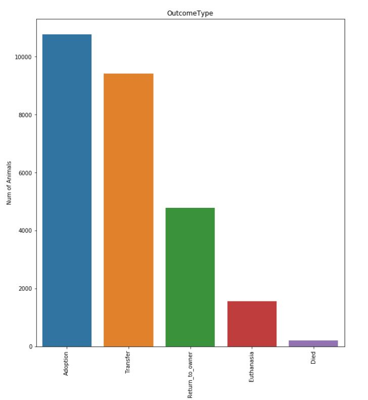

# Shelter Animal Outcomes - A Machine Learning Project #
Authors: Danielle Adler, Alla Hale, John Pette

This machine learning project predicted shelter animal outcomes using Python, based on a data set from a former Kaggle competition. The project used pandas to refine the unbalanced data, matplotlib and pandas for exporatory data analysis (EDA), and scikit-learn to run machine learning algorithms (including logistic regression, decision trees, random forest, XGBoost, and Multinomial Naive Bayes).

Our initial look at the data reveals 26,729 rows. We set out to predict the outcomes for individual shelter animals, which were extremely unbalanced:

To adjust for this, we tested machine learning models using both the raw data and data that oversampled from the minority classes.

We transformed and bucketed some features, as several features contained very sparse data. For example, there were 1,380 unique breeds among the 26,729 total records. Many of these were combinations of breeds and colors. We reduced these by focusing on the principal listed breed and splitting color out of the breed name. This reduced the quantity of breeds to from 1,380 to 225. We binarized many of the remaining variables. 

We established baseline performance using a “dumb” classifier, which predicted the majority outcome (adoption) for each input record. We then built models using a variety of algorithms to assess basic performance, and then narrowed down our pool of classifiers, refining the best performing models. 

To evaluate prediction performance, we used weighted f1-score, which is calculated using a proportional weight of the f1-score of all classes, and works best when classes are not balanced. The f1-score itself takes into account both precision (ratio of the true positives to true and false positives) and recall (ratio of the true positives to true positives and false negatives). Therefore, the f1-score is essentially accounting for both false positives and false negatives without needing to weight them equally. 

Best performing classifiers with confidence intervals:

The f1-scores for the classifiers fit with raw data performed substantially worse than the random forest classifiers fit with oversampled data. There was little difference in performance between the random forest and XGBoost classifiers, but random forest was much faster, so we choose random forest for optimization. We found that the best parameters included a maximum depth of 40, a minimum sample split of 4, and Gini impurity to measure the split quality.

We further tested performance by examining the log loss function of our classifiers. Log loss analyzes accuracy, as it penalizes false predictions (a smaller value is better). The log loss of the dumb classifier was 20.62. We checked the log loss of our top performing classifiers using raw data, and found substantial improvement with all:

